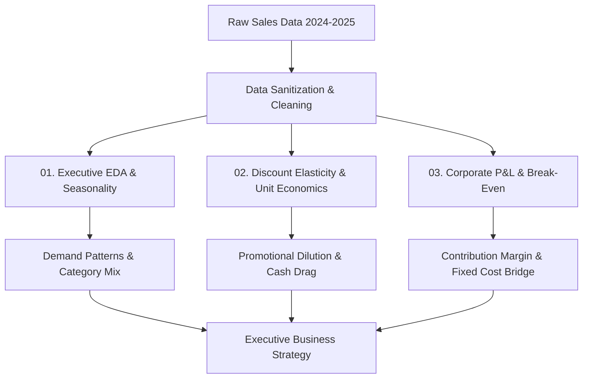

# 📊 E-Commerce Commercial & Financial Analytics Suite

An end-to-end analytics framework covering executive exploratory data analysis (EDA), promotional unit economics, and full-spectrum P&L decomposition for a high-volume retail portfolio.

---

## 🏗️ Analytics Architecture & Pipeline


## 🧭 Financial Breakdown & Margin Flow
flowchart LR
    Rev[Gross Revenue 100%] --> COGS[COGS ~85.1%]
    Rev --> GP[Gross Profit ~14.9%]
    
    GP --> Mkt[Marketing / CAC 10.0%]
    GP --> CM[Contribution Profit ~4.9%]
    
    CM --> Fixed[Fixed Overhead $50k/mo]
    CM --> NP[Net Profit / Retained Margin]
    ччч
    
## 📈 Key Analytical Highlights & Findings
1. Macro Seasonality & Scale (Notebook 01)
Q4 Concentration: Significant volume surges driven by holiday trading cycles.

Category Dominance: Core revenue drivers require selective inventory buffering to prevent stockouts.

2. Discount Elasticity & Cash Drag (Notebook 02)
Margin Illusion: Mathematical percentage margin remains stable at ~15.0%, but dollar profit per unit collapses by -20.28% at 20% discount tiers.

Volume Inelasticity: High promotional tiers fail to drive sufficient incremental volume (+3.48% units) to offset price dilution.

3. Corporate P&L & Break-Even Absorption (Notebook 03)
Break-Even Run-Rate: Minimum monthly revenue threshold of $1.05M - $1.15M required to cover $50k fixed overhead.

CAC Buffer: With a baseline gross margin of ~14.9%, marketing allocation must not exceed 10.0% of gross revenue to protect operational solvency.

## 🛠️ Project Structure
```
├── data/
│   └── Ecommerce_Sales_Data_2024_2025.csv
├── notebooks/
│   ├── 01_Executive_EDA_Seasonality.ipynb
│   ├── 02_Discount_Elasticity_Unit_Economics.ipynb
│   └── 03_Corporate_PnL_BreakEven.ipynb
└── README.md
```

## 💻 Tech Stack & Tools
Python 3.10+

Data Manipulation: pandas, numpy

Visualization: matplotlib, seaborn, plotly

Environment: Jupyter Notebooks
