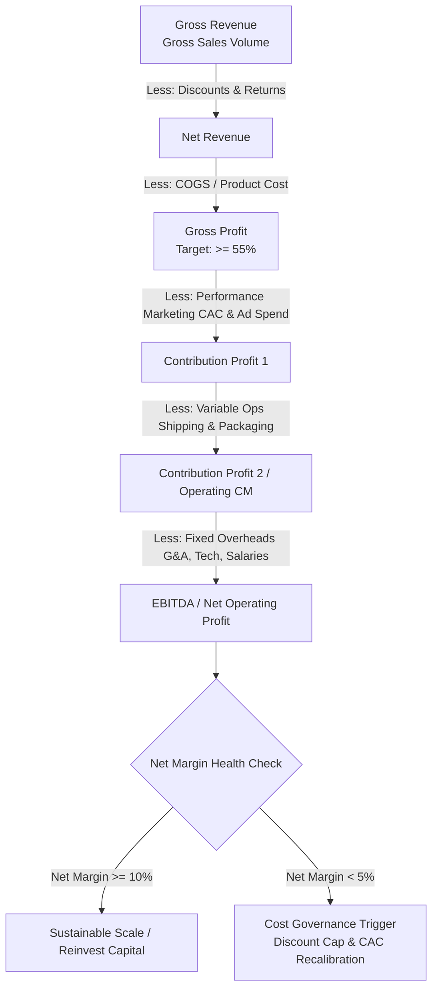

# 📊 E-Commerce Unit Economics & P&L Profitability Analytics

[](https://www.python.org/)
[](https://pandas.pydata.org/)
[](https://plotly.com/)
[](https://dash.plotly.com/)
[](LICENSE)

> A strategic financial analytics and unit economics framework for Direct-to-Consumer (D2C) e-commerce, evaluating top-line growth efficiency, discount margin erosion, contribution profitability, and cost-structure waterfall dynamics.

---

## 🎯 Executive Summary

In fast-scaling Direct-to-Consumer (D2C) e-commerce, revenue growth often masks severe margin compression. This project establishes an executive-level **Financial & Business Analytics framework** to dissect the conversion of Gross Revenue into Net Profit.

### Core Strategic Focus Areas
* **Growth vs. Quality:** Determining whether incremental top-line expansion delivers sustainable bottom-line cash flow.
* **Discount Elasticity & Margin Dilution:** Quantifying the inflection point where promotional discounts erode gross profit faster than volume compensates.
* **Contribution Margin (CM) Health:** Evaluating marketing efficiency (CAC/ROAS) against variable fulfillment costs.
* **Cost Structure Transparency:** Building end-to-end P&L visibility and waterfall decomposition to guide pricing and operational scaling decisions.

---

## 🗂️ Project Architecture & Repository Structure

```text
ecommerce-profitability-pl-analytics/
├── data/
│   ├── raw/
│   └── processed/
├── notebooks/
│   ├── 01_revenue_and_profit_dynamics.ipynb     # Top-line vs bottom-line divergence & margin ratios
│   ├── 02_discount_impact_unit_economics.ipynb  # Promotional elasticity and margin compression analysis
│   └── 03_p_and_l_waterfall_decomposition.ipynb # Full P&L breakdown and waterfall visualization
├── app/
│   ├── dashboard.py                             # Interactive Dash/Plotly financial monitoring app
│   └── components/                              # Reusable chart layouts and KPI cards
├── src/
│   ├── pl_engine.py                             # P&L calculation and aggregation pipelines
│   └── visualizers.py                           # Plotly waterfall and trend plotting modules
├── assets/                                      # Rendered dashboard screenshots and diagrams
├── requirements.txt                             # Python dependencies
└── README.md
```

---

## 🔄 End-to-End P&L Waterfall Architecture



---

## 📈 Executive Financial KPI Snapshot

| Metric | Benchmark / Sample Value | Business & Management Definition |
| :--- | :--- | :--- |
| **Gross Margin %** | `58.4%` | Product profitability prior to marketing and fulfillment |
| **Blended Discount Rate** | `14.2%` | Average promotional deduction across catalog transactions |
| **Contribution Margin 1 (CM1)** | `32.6%` | Gross Profit minus Paid Acquisition (Marketing efficiency index) |
| **Contribution Margin 2 (CM2)** | `21.8%` | Post-fulfillment margin available to cover fixed corporate overheads |
| **Net Profit Margin** | `8.4%` | Bottom-line retained earnings percentage |
| **Operating Leverage Ratio** | `1.42x` | Rate of net profit growth relative to net sales growth |

---

## 🖼️ Visual Insights & Dashboard Previews

<p align="center">
  
  <br>
  <em>Figure 1: Full-Structure Financial Waterfall — Decomposing Gross Revenue to Net Operating Profit</em>
</p>

<table width="100%">
  <tr>
    <td width="50%" align="center">
      
      <br><strong>Figure 2:</strong> Top-Line Growth vs. Operating Margin Divergence
    </td>
    <td width="50%" align="center">
      
      <br><strong>Figure 3:</strong> Discount Depth vs. Realized Contribution Margin
    </td>
  </tr>
</table>

---

## 💡 Key Strategic Findings & Policy Levers

1. **The Promotional Trap:** Discounts exceeding **20%** require a $>45\%$ volume surge to maintain equivalent gross dollar margin, often resulting in negative CM2 after fulfillment costs.
2. **Paid Acquisition Drag:** Marketing expenditure scales non-linearly during peak promotional events (e.g., Q4), causing CM1 to compress despite record top-line revenue.
3. **Fixed Overhead Leverage:** Once cumulative monthly Net Sales exceed the breakeven threshold of **$180K**, incremental sales drop $\approx 22\%$ directly to Net Operating Profit.

### Management Decision Framework

| Trigger Signal | Root Cause | Immediate Management Action |
| :--- | :--- | :--- |
| **CM1 Drop $<25\%$** | Rising CAC / Ad exhaustion | Pause low-ROAS ad sets; restrict broad discounts |
| **CM2 Compression** | Shipping surcharge spikes | Renegotiate 3PL logistics tiers; enforce free-shipping thresholds |
| **Net Margin $<5\%$** | Fixed cost over-expansion | Freeze non-essential OPEX; prioritize high-margin SKU mix |

---

## 🚀 Quickstart & Reproduction

### 1. Clone & Setup Environment
```bash
git clone [https://github.com/your-username/ecommerce-profitability-pl-analytics.git](https://github.com/your-username/ecommerce-profitability-pl-analytics.git)
cd ecommerce-profitability-pl-analytics

# Create and activate virtual environment
python -m venv venv
source venv/bin/activate  # On Windows: venv\Scripts\activate

# Install dependencies
pip install -r requirements.txt
```

### 2. Run Financial Analysis Notebooks
```bash
jupyter lab
```

### 3. Launch Interactive Dash Application
```bash
python app/dashboard.py
# Open your browser at [http://127.0.0.1:8050/](http://127.0.0.1:8050/)
```

---

## 🛠️ Tech Stack & Dependencies

- **Data Processing:** `Python 3.10+`, `pandas >= 2.0.0`, `numpy >= 1.24.0`
- **Interactive Visualizations:** `plotly >= 5.18.0`
- **Executive Dashboard:** `dash >= 2.14.0`, `dash-bootstrap-components >= 1.5.0`
- **Analysis Environment:** `jupyterlab >= 4.0.0`

---

## 📄 License
Distributed under the MIT License. See `LICENSE` for details.
